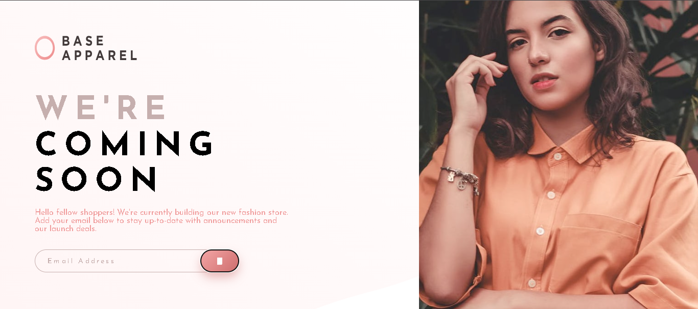

# Base Apparel - Coming Soon Page 👕 : 

A clean and modern **"Coming Soon" landing page** for a fashion brand with a sleek design, responsive layout, and functional email validation. 

## ✨ Features

- **Responsive Design** – Optimized for mobile, tablet, and desktop
  
- **Real-time Email Validation** – Instant feedback with error messages
  
- **Success State** – Shows confirmation when email is submitted
  
- **Modern UI/UX** – Elegant typography and smooth interactions
  
- **Pixel-perfect** implementation matching the original design
  
- **Accessibility** – Proper form labels and keyboard navigation

## 🚀 Live Demo

[**View Live Demo**](# https://mansityagi548.github.io/base-apparel-coming-soon/) 

 

## 🛠️ Technologies Used

- **HTML5** – Semantic markup
  
- **CSS3** – Flexbox, Custom Properties, Responsive design
  
- **Vanilla JavaScript** – Form validation and interactive states
  

## 🎯 What This Project Demonstrates

- Strong foundation in **responsive web design**
  
- Form handling and **client-side validation** using JavaScript
  
- Creating engaging user interfaces with clean code
  
- Attention to detail in matching design systems
  
- Building production-ready static landing pages

